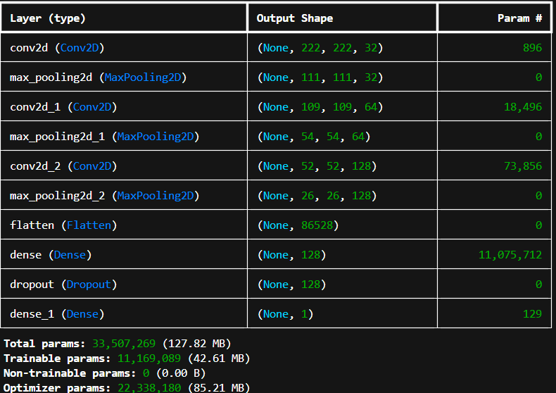
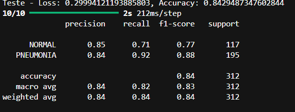

# 🫁 PneumoFinder CNN (Keras + TensorFlow) 🤖

Este projeto tem como objetivo detectar pneumonia a partir de imagens de raio-X de pulmões utilizando uma Rede Neural Convolucional (CNN) desenvolvida com TensorFlow e Keras, a aplicação foi construída como um estudo prático na disciplina de Inteligência Artificial, focando no uso de técnicas modernas de Visão Computacional aplicadas à área da saúde. A classificação é binária, distinguindo entre pulmões saudáveis (NORMAL) e pulmões com pneumonia (PNEUMONIA).

> 🚀 Ideal para aplicação em cenários médicos que exigem triagem rápida com alto desempenho.

## 🌊 O Fluxo do Sistema


---

## 🔧 Técnicas Utilizadas

Durante o desenvolvimento e treinamento do modelo, diversas estratégias foram aplicadas para aumentar o desempenho e a generalização:

### 📈 Data Augmentation
Utilizei o `ImageDataGenerator` com os seguintes parâmetros para aumentar artificialmente o conjunto de treinamento:
- **Rotação aleatória de até 15°**
- **Zoom de até 10%**
- **Deslocamento horizontal e vertical**
- **Espelhamento horizontal**
- **Normalização dos pixels** (rescale)

Essa técnica ajuda a evitar overfitting e simula variações reais nos dados.

### 🧪 Divisão dos Dados
Os dados foram separados em três conjuntos:
- **Treinamento** – com augmentations
- **Validação** – para monitorar o desempenho durante o treinamento
- **Teste** – para avaliação final do modelo (sem augmentations)

### 🧠 Callbacks
Implementei duas técnicas fundamentais durante o processo de treinamento:
- **ModelCheckpoint** – Salva automaticamente o modelo com a melhor acurácia de validação (`val_accuracy`)
- **EarlyStopping** – Para o treinamento se a `val_loss` não melhorasse por 3 épocas consecutivas, evitando overfitting

---

## 🧰 Tecnologias Utilizadas

Este projeto foi desenvolvido utilizando as seguintes tecnologias e bibliotecas:

### 👨🏻‍💻 Linguagem
- **Python 3.11** – Linguagem principal para desenvolvimento do modelo e scripts auxiliares

### 🧠 Frameworks e Bibliotecas de IA
- **TensorFlow** – Framework principal para construção e treinamento da CNN
- **Keras** – API de alto nível do TensorFlow, utilizada para definição da arquitetura da rede
- **NumPy** – Manipulação de arrays e operações matemáticas vetorizadas
- **Matplotlib** e **Seaborn** – Visualização de métricas e gráficos de desempenho

### 📂 Organização e Utilitários
- **scikit-learn** – Cálculo de métricas de avaliação (accuracy, precision, recall, F1-score, confusion matrix)
- **OS / Pathlib** – Navegação entre diretórios e manipulação de caminhos
- **tqdm** – Barra de progresso para loops
- **PIL (Pillow)** – Manipulação e leitura de imagens
  
### 🧪 Ciência de Dados
- **Pandas** – Estruturação de dados tabulares (auxiliar nos scripts de avaliação)

> 📦 Todas as dependências podem ser instaladas via `pip` utilizando o arquivo `requirements.txt`.

---

## 🧬 Arquitetura do Modelo CNN

A arquitetura da rede foi implementada utilizando o modelo `Sequential`, com camadas convolucionais empilhadas progressivamente:

- **3 Camadas Convolucionais** com filtros 3x3 e funções de ativação ReLU
- **3 Camadas de MaxPooling 2x2** para reduzir dimensionalidade
- **Camada Flatten** para transformar os mapas de características em um vetor unidimensional
- **Camada Densa com 128 neurônios**
- **Camada de Dropout (50%)** para combater o overfitting
- **Camada de Saída com ativação Sigmoid**, para previsão binária (0 = normal, 1 = pneumonia)

A rede foi compilada com o **otimizador Adam** e **função de perda Binary Crossentropy**, adequados para o problema de classificação binária.

### A arquitetura da CNN desenvolvida é descrita na imagem abaixo:



---

## 📂 Estrutura do Projeto

```text
├── .gitignore                 # Arquivos e pastas ignorados pelo Git
├── README.md                 # Documentação do projeto
├── requirements.txt          # Bibliotecas e dependências do projeto
├── avaliacao.py              # Script para avaliação e geração de métricas
├── main.py                   # Script principal (executa o pipeline completo)
├── modelo.py                 # Define e retorna a arquitetura da CNN
├── preprocessamento.py       # Pré-processamento de imagens
├── treinamento.py            # Script de treinamento da CNN
├── dataset/                  # Conjunto de dados dividido em treino, validação e teste
│   ├── train/
│   │   ├── NORMAL/
│   │   └── PNEUMONIA/
│   ├── val/
│   │   ├── NORMAL/
│   │   └── PNEUMONIA/
│   └── test/
│       ├── NORMAL/
│       └── PNEUMONIA/
├── imagens - treino/         # (Opcional) Outras imagens usadas durante o processo
├── imgs_docs/                # Imagens utilizadas na documentação (README)
│   ├── model_summary.png
│   ├── image.png
│   ├── image 1.png
│   └── image copy.png
├── usar_modelo/              # Scripts e recursos para uso do modelo treinado
│   ├── pneumo_finder.py      # Função principal de predição
│   ├── usar_modelo.py        # Executável para testar imagens externas
│   └── imgs/                 # Imagens externas para predição
└── venv/                     # Ambiente virtual Python (não incluir no versionamento)

```

---

## 📊 Desempenho do Modelo

Ao final do treinamento, foram geradas diversas análises para entender o desempenho do modelo:

- **Gráficos de Acurácia e Perda (Loss)**
- **Matriz de Confusão** – Visualização dos acertos e erros
- **Relatórios de Classificação (Precision, Recall, F1-Score)**

Esses recursos forneceram uma visão clara da capacidade do modelo em generalizar para dados não vistos.

| Métrica               | Valor           |
|-----------------------|-----------------|
| Accuracy              | Alta 🔝         |
| Precision & Recall    | Balanceados ⚖️ |
| F1-Score              | Otimizado 💯   |

### 📈 Métricas detalhadas:


### 🧮 Matriz de Confusão:


### 🌀 Evolução durante o treinamento:


---

## 🛠️ Como Executar

### 1. Clone o repositório
```bash
git clone git@github.com:CauZy-Goes/PneumoFinder_CNN_Keras_TensorFlow.git
cd /PneumoFinder_CNN_Keras_TensorFlow
```

### 2. Crie e ative o ambiente virtual
```bash
python -m venv venv
venv\Scripts\activate  # Windows
# ou
source venv/bin/activate  # Linux/Mac
```

### 3. Instale as dependências
📦 Todas as dependências podem ser instaladas via [`requirements.txt`](requirements.txt)
```bash
pip install -r requirements.txt
```

### 4. Execute o treinamento
O script `main.py` realiza todo o pipeline automaticamente:

- Pré-processa as imagens dos diretórios `train`, `val` e `test`
- Cria a arquitetura da CNN
- Treina o modelo com `EarlyStopping` e `ModelCheckpoint`
- Avalia o desempenho em dados de teste
- Plota gráficos de histórico
- Salva o modelo treinado como `best_model.keras` na raiz do projeto

```bash
python main.py
```

> 📁 O arquivo best_model.keras será gerado automaticamente na raiz após o treinamento.

---

## 🚦 Executando a Classificação

### 🔍 Diagnóstico de novas imagens

Você pode usar o script interativo `usar_modelo.py` para diagnosticar imagens externas com o modelo treinado:

O menu interativo oferece duas opções:

- **Diagnosticar uma imagem específica** (forneça o nome dela dentro da pasta `usar_modelo/imgs/`)
- **Diagnosticar todas as imagens** contidas na pasta `usar_modelo/imgs/`

A predição informará se a imagem é classificada como **NORMAL** ou **PNEUMONIA**, junto da **confiança da predição**.

> 📁 **Certifique-se de que o arquivo** `best_model.keras` **está presente na raiz do projeto** e que as imagens estejam na pasta `usar_modelo/imgs/`.

```bash
python usar_modelo.py
```
---

## ⚖️ Licença

Distribuído sob a licença [MIT](LICENSE).  
Sinta-se livre para usar, modificar e contribuir com este projeto.

---

## 💬 Feedback & Contribuições

Pull requests e sugestões são muito bem-vindas!  
Se encontrar algum problema ou tiver ideias para melhorar o projeto, abra uma **issue** 

## 👨🏻‍💻 Autor

Projeto desenvolvido por [**Cauã Farias**](https://github.com/CauZy-Goes) durante a disciplina de **Inteligência Artificial** do curso de **Engenharia de Software**.

> 🎓 Projeto acadêmico com grande aplicabilidade prática na área da saúde.

---
